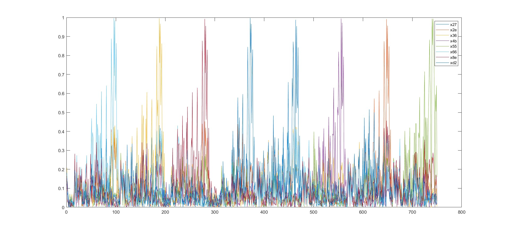
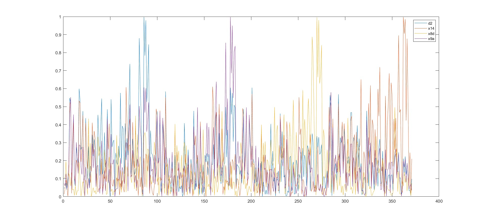

# BNN (neural network)

## bin2tarce.py
This file converts *.bin files into *.trace and *.txt files.   
```bash
python3 bin2trace.py
```
## Solution idea
There are eight input nodes and hidden nodes.   
The input values of each input node are 0 or 1, and the input values of the hidden node are -1 or 1.   
That is, only two types of values are input to the node.   
If each node is treated as one bit, eight nodes mean eight bits, or one byte.   
The first weight will be eight 1-byte values and the second weight will be four 1-byte values.   
## Solution C code
### The method for outputting the first weight is as follows.
If you want to get first weight vlaues, Go to the include folder and set the macro in the "parameter.h" file.   
```c
#define frist
```
or you want to second weight values, just remove the macro
### How to execute code
```bash
$ make
$ cd output
$ ./main
```
### Order of weight values (created by mathlab)
**The order of the first weights**

**The order of the second weights**

**How to create plot?**
```
$ cd mathlab
```
start OrderOfWeight.m   
Please enter the path where mathlab folder is located in the variable.  
```
res_path = <File path>;   
```
If you want to get a second weighted graph, erase the %

```mathlab
%second_weight_str = 'D2 14 8D 9A';
%RESULT_NO = 4;
%KEY = sscanf(second_weight_str, '%x', [START_BYTE (START_BYTE + RESULT_NO - 1)]);
%path=strcat(res_path, '\\mathlab\\second\\%03d(0x%02x).txt');
```
and add % In front of folows
```
first_weight_str
RESULT_NO = 8
KEY = sscanf(first_weight_str, '%x', [START_BYTE (START_BYTE + RESULT_NO - 1)]);
path=strcat(res_path, '\\mathlab\\first\\%03d(0x%02x).txt');
```

## Get the flag

```
$ gcc flag.c -o flag
```